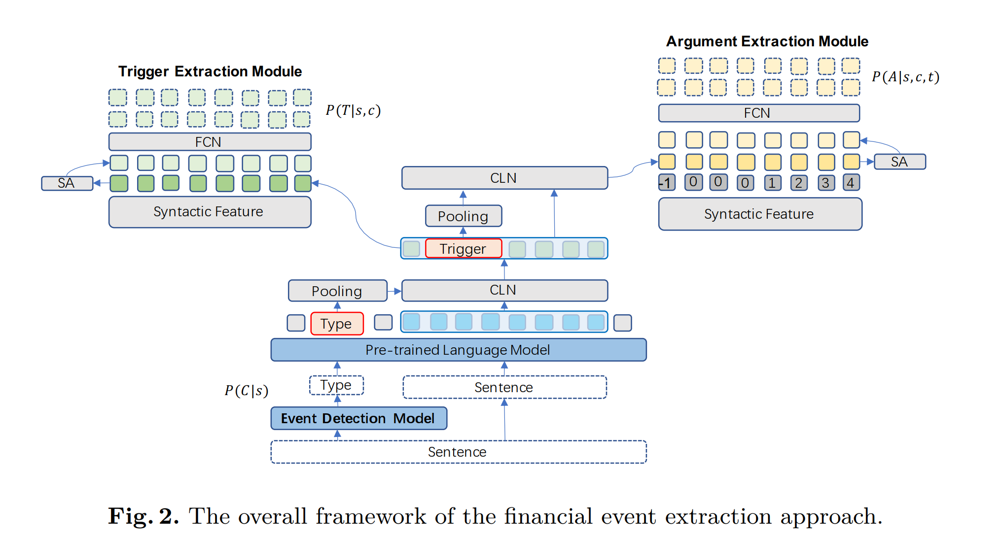
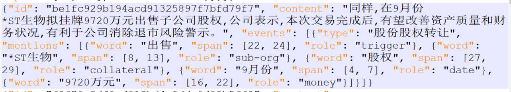

代码是对**A Joint Learning Framework for the CCKS-2020 Financial Event Extraction Task**  这篇论文的复现

模型基本结构

# 一些实现细节

## 数据的读取与处理

这次决定尝试全程对直接从文件中读取的事件结构进行操作，即

就是这个样子。

我之前尝试了用一个Event类型进行统一处理，除了计算trigger和argument的span之外好像没有别的很方便的地方。

dict的list还是比较省空间的方案，每一个句子都创建一个对象还更难序列化，内存又大。

